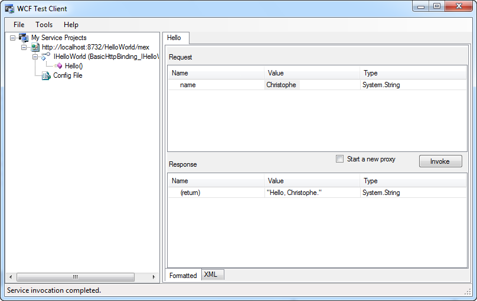

# WCF Message Logging

## Introduction

Suppose you create and host a WCF service and want to log all inbound and outbound messages. How would you go about this? When hosting a service you need to define a service behavior that knows how to log the messages. This post demonstrates how to setup a message logging system that provides this functionality.

## Demo Application

Let's quickly create a demo application. Start up Visual Studio and create a new blank solution called "MessageLogging". Next add a new WCF Service Library to the project called "HelloWorldService".


Rename the IService1.cs file to IHelloWorld.cs. The demo service is just a simple ("Hello, World!") greeting service. The service contract only declares one operation.

```csharp
[ServiceContract]
public interface IHelloWorld
{
    [OperationContract]
    string Hello(string name);
}
To finish the service rename the Service1.cs file to HelloWorld.cs and create a service implementation as follows:

public class HelloWorld : IHelloWorld
{
    public string Hello(string name)
    {
        return String.Format("Hello, {0}.", name);
    }
}
```

I used the basicHttpBinding binding to expose the endpoint. Just copy and paste the following configuration in your app.config.

```xml
<system.serviceModel>
  <services>
    <service name="HelloWorldService.HelloWorld">
      <endpoint address="" binding="basicHttpBinding"
                contract="HelloWorldService.IHelloWorld" />
      <endpoint address="mex" binding="mexHttpBinding"
                contract="IMetadataExchange" />
      <host>
        <baseAddresses>
          <add baseAddress="http://localhost:8732/HelloWorld" />
        </baseAddresses>
      </host>
    </service>
  </services>
  <behaviors>
    <serviceBehaviors>
      <behavior>
        <serviceMetadata httpGetEnabled="True"/>
        <serviceDebug includeExceptionDetailInFaults="False" />
      </behavior>
    </serviceBehaviors>
  </behaviors>
</system.serviceModel>
```

Hit F5 to start the WCF Test Client. The service is now up and running.



## IDispatchMessageInspector & IServiceBehavior Interfaces

The WCF Test Client already logs all the messages the service receives and sends out, but we want to be able to do it ourselves.


To do so, we need to implement the [IDispatchMessageInspector](http://msdn.microsoft.com/en-us/library/system.servicemodel.dispatcher.idispatchmessageinspector.aspx) and [IServiceBehavior](http://social.msdn.microsoft.com/Search/en-us?query=IServiceBehavior+) interfaces. The IDispatchMessageInspector interface defines methods that enable us to inspect (and modify) the inbound and outbound messages. The IServiceBehavior interface provides us with a mechanism to insert custom extensions for a service.

Add a new class called WcfMessageLogger to the project and implement the IDispatchMessageInspector and IServiceBehavior interfaces.

```csharp
public class WcfMessageLogger : IDispatchMessageInspector, IServiceBehavior
{
    #region IDispatchMessageInspector

    public object AfterReceiveRequest(ref Message request, IClientChannel channel,
        InstanceContext instanceContext)
    {
        Debug.Write(request.ToString());
        return null;
    }

    public void BeforeSendReply(ref Message reply, object correlationState)
    {
        Debug.Write(reply.ToString());
    }

    #endregion

    #region IServiceBehavior

    public void ApplyDispatchBehavior(ServiceDescription serviceDescription,
        ServiceHostBase serviceHostBase)
    {
        foreach(ChannelDispatcher dispatcher in serviceHostBase.ChannelDispatchers)
        {
            foreach(var endpoint in dispatcher.Endpoints)
            {
                endpoint.DispatchRuntime.MessageInspectors.Add(new WcfMessageLogger());
            }
        }
    }

    public void AddBindingParameters(ServiceDescription serviceDescription,
        ServiceHostBase serviceHostBase, Collection<ServiceEndpoint> endpoints,
        BindingParameterCollection bindingParameters)
    {
    }

    public void Validate(ServiceDescription serviceDescription,
        ServiceHostBase serviceHostBase)
    {
    }

    #endregion
}
```

The AfterReceiveRequest and BeforeSendReply methods provided by the IDispatchMessageInspector interface both contain a parameter of the [Message](http://msdn.microsoft.com/en-us/library/system.servicemodel.channels.message.aspx) type. By calling the ToString() method on these instances you can get a hold of the SOAP message that was received or is about to be sent out. Here I just write the messages to the output window. In the real world you might do something useful with them (logging, modifying...etc).

The ApplyDispatchBehavior method of the IServiceBehavior interface insert an instance of the WcfMessageLogger message inspector into the dispatch runtime of each endpoint. Just leave the other methods provided by these two interfaces empty. They are not required for logging the messages.

## Configuration

We just created our first message inspector. Now we need to insert it into the WCF pipeline. Preferably by configuration. We need to register a behavior extension to be able to do this ([BehaviorExtensionElement](http://msdn.microsoft.com/en-us/library/system.servicemodel.configuration.behaviorextensionelement.aspx)).

Create a new class called WcfMessageLoggerExtension and add the following code to it:

```csharp
public class WcfMessageLoggerExtension : BehaviorExtensionElement
{
    protected override object CreateBehavior()
    {
        return new WcfMessageLogger();
    }

    public override Type BehaviorType
    {
        get
        {
            return typeof(WcfMessageLogger);
        }
    }
}
```

This BehaviorExtensionElement is a configuration element that allows you to specify behavior extensions, such as service or endpoint behaviors. To register the extension add the following section to your configuration file in the <system.ServiceModel> node:

```xml
<extensions>
  <behaviorExtensions>
    <add name="WcfMessageLogger"
          type="HelloWorldService.WcfMessageLoggerExtension, HelloWorldService" />
  </behaviorExtensions>
</extensions>
```

This registers the WcfMessageLogger as a behavioral extension. Now you can add this new behavior to the service behavior configuration.

```xml
<behaviors>
  <serviceBehaviors>
    <behavior>
      <serviceMetadata httpGetEnabled="True"/>
      <serviceDebug includeExceptionDetailInFaults="False" />
      <WcfMessageLogger />
    </behavior>
  </serviceBehaviors>
</behaviors>
```

Hit F5 to run the WCF Test Client again and invoke the Hello() method. You'll notice that the request and response SOAP messages are now being logged and displayed in the output window.


That's all there is to it. Implement the IDispatchMessageInspector and IServiceBehavior interfaces. Register a behavior extension element and adjust your configuration.
